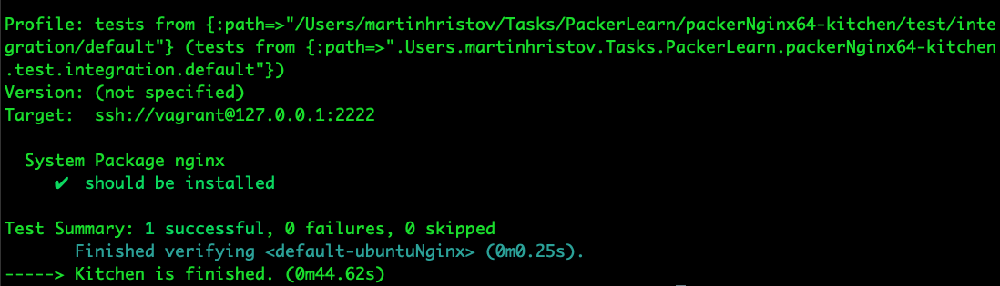

# How to create a vagrant base box

# Purpose

This repository's sole purpose is to demonstrate how to built a Vagrant box with virtual box provider using Packer which provides Nginx webserver, and then test it with KitchenCI.

# Technologies in use :

- Packer
- Vagrant
- VirtualBox
- Nginx
- KitchenCI
- InSpec

# How to install the needed technologies :

- [How to install Packer](https://www.packer.io/intro/getting-started/install.html)
- [How to install Vagrant](https://www.vagrantup.com/docs/installation/)
- [How to install VirtualBox](https://www.virtualbox.org/manual/ch02.html)


# How to use :

- Clone this git repository using `git clone https://github.com/martinhristov90/packerNginx64-kitchen.git`
- Switch into the directory of the project using : `cd packerNginx64-kitchen`
- Let Packer build the Vagrant box for you using : `packer build templete.json`
- You should now have Vagrant box which upon booting starts Nginx web server.
- Use command `vagrant box add ubuntu-1604-vbox.box --name DESIRED_NAME` to add the box to Vagrant.
- List available boxes with `vagrant box list`, the imported box should be listed.
- In order to boot the box with Vagrant, Vagrantfile needs to be generated. Use `vagrant init -m`, to generate simple Vagrantfile
- Type `vagrant up`.

### NB : Make sure you execute the abovementioned commands in `packerNginx64` directory.


# Now you should have a running Vagrantbox with nginx installed. Next step is test that nginx is running.

# How to setup KitchenCI (MacOS Mojave).

- For using [KitchenCI](https://kitchen.ci/), ruby environment needs to be set up first.
- Run `brew install ruby`
- After previous command finish, run `gem install rbenv`, this would give you ability to choose particular version of Ruby. This is a prerequisite.
- Next, [Bundler](https://bundler.io) needs to be installed, run `gem install bundler`, this would provide the dependencies that KitchenCI needs. It is going to install the Gems defined in the `Gemfile`
- Run the following two commands, to setup Ruby environment for the local directory.
    ```bash
    echo 'export PATH="$HOME/.rbenv/bin:$PATH"' >> ~/.bash_profile
    echo 'eval "$(rbenv init -)"' >> ~/.bash_profile
    ```
- Reload your BASH interpreter.
- Verify rbenv is installed properly with :
    ```shell
    type rbenv   # → "rbenv is a function"
    ```
- To install the particular version that we need, run the following command in the project directory:
    ```shell
    rbenv install 2.5.3
    ```
- Set local version to be used with command :
    ```shell
    rbenv local 2.5.3
    ```
- Previous step is going to create a file named .ruby-version, with the following content `2.5.3`
- Install the needed Gems for KitchenCI using Bundle with command :
    ```shell
    bundle install
    ```
- Run Kitchen in the context of Bundle with the following command : 
    ```shell
    bundle exec kitchen list
    ```
- Build the testing environment with:
    ```shell
    bundle exec kitchen converge
    ```
- Test it : 
    ```shell
    bundle exec kitchen verify
    ```
- The test that is going to be performed is using `[InSpec](https://www.inspec.io)` , project location is `test/integration/default`, it looks like this :
    ```ruby
    describe package('nginx') do
    it { should be_installed } 
    end
    ```
- To destroy the testing environment use :
    ```shell
    bundle exec kitchen destroy
    ```
- If the Nginx is running, you should get an output like this :

